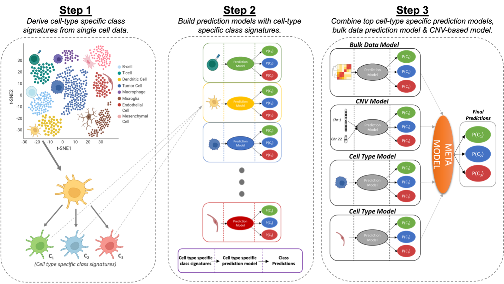

# CLIPPR
**CLIPPR** is an algorithm that combines the top-performing **single-cell** models with RNA-inferred **copy number variation (CNV)** signals and the initial **bulk** model to create a **meta-model**, which exhibits the strongest performance in meningioma classification. It shows superior overall accuracy and resolved benign-malignant confusion. The generalizability of CLIPPR has been validated using our single-cell and bulk glioma data. CLIPPR synergizes the resolution of single-cell data with the depth of bulk sequencing, enabling improved cancer sub-group diagnoses and insights into their biology.

## Model Description 
CLIPPR is a meta-model that predicts the meningioma classes by leveraging single-cell data and RNA-inferred CNV signal to enhance the prediction accuracy of bulk data classifiers. We demonstrate that combining the top-performing single-cell models, CNV models, and the initial bulk model into a meta-model resulted in the strongest performance, with superior overall accuracy and benign-malignant resolution. The overview of the CLIPPR algorithm is shown below.  
  

  
In more detail, CLIPPR aims to leverage insights from both bulk transcriptomic and single-cell sequencing to generate high-performing models for the accurate classification of bulk transcriptomic sequencing. To this end, CLIPPR utilizes three distinct sets of features: **a)** Differentially expressed genes (DEGs) specific to each subtype derived from bulk RNA-Seq data. **b)** DEGs that are specific to both cell type and subtype, extracted from single-cell RNA-Seq. **c)** CNV profiles of each subtype inferred from bulk transcriptomics.  
  
- **Bulk RNA-Seq-based model (bulkRF)**  
We trained a baseline bulk-transcriptomic model using the DEGs specific to each class within the well-characterized bulk RNA-Seq meningioma samples in the training cohort. These DEGs were used to train a Random Forest classifier.

- **ScRNA-Seq-based cell-type-specific models (ctRFs)**  
To leverage single-cell sequencing, we identified cell-type-specific, class-specific differentially expressed genes (scDEGs). The bulk RNA-Seq sequencing corresponding to each set of scDEGs genes was then used to train the cell-type-specific Random Forest models (ctRFs).

- **CNV-based model (cnvRF)**  
In previous work, we demonstrated how CNV profiles can be inferred from bulk transcriptomics and the utility of these profiles in the accurate classification of tumors. Leveraging our previously published tool, _**CaSpER**_, we generated RNA-inferred CNV profiles for each sample and employed them in training a CNV-based Random Forest classifier (cnvRF).  
  
In summary, the input for CLIPPR consists of aligned single-cell and bulk RNA-seq read counts, as well as the bulk RNA-seq training cohort sample names and tumor classes (subtypes). Additionally, the input requires the tumor classes and cell types for each cell within the single-cell data. The outputs of the bulkRF, ctRFs, and cnvRF, which are probabilities that a given sample of each possible class, are used as features in a Random Forest model. Thus, the scRFs, cnvRF, and bulkRF are integrated into a meta-model that is used to assign a sample’s final classification.  
  
## Application
CLIPPR is implemented in R. A usage example is provided below.  
  
```
object <- CreateCLIPPRObject(
    bulkdata = bulk_count_data,
    bulk_normalized_data = bulk_normalized_data,
    bulkdata_ss = samples,
    seurat_obj = seurat_obj
)

project_id <- "032323_MN"
object <- runFeatureSelection(object)
object <- extractCNVSignal(object, project_id)
object <- runCNVClassifier(object, fts = c("chr1p", "chr14q","chr22q"))
object <- runClassifier(object)

object <- runMetaModel(object, modelNames = c( "RF.Pred_bulk", "RF.Pred_mesenchymalMarkers",  "RF.Pred_T.cellMarkers"), cnvModelName="RF.Pred_CNV_chrmean", CNV = T)
```
  
The workflow of CLIPPR is intuitive and straightforward as shown in the code above.  
- `CreateCLIPPRObject` creates a **CLIPPR object** with bulk raw data, bulk count data, single-cell data, and bulk sample phenotypes.
- `runFeatureSelection` conducts single-cell and bulk class-specific **feature selection**.
- `extractCNVSignal` calculates the mean smoothed **CNV signal** for each `chr` using _**CaSpER**_.
- `runCNVClassifier` performs **random forest classification** with the model trained on selected `chr`.
- `runClassifier` performs **random forest classification** with the model trained on single-cell and bulk features.
- `runMetaModel` runs the **integrated meta-model** using all the classifiers.
